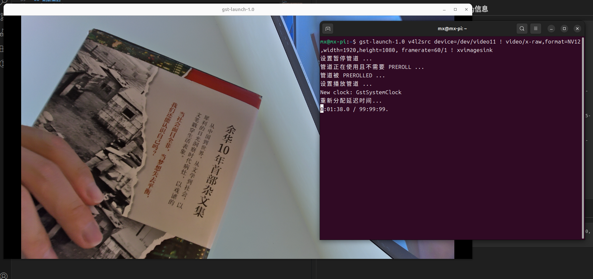
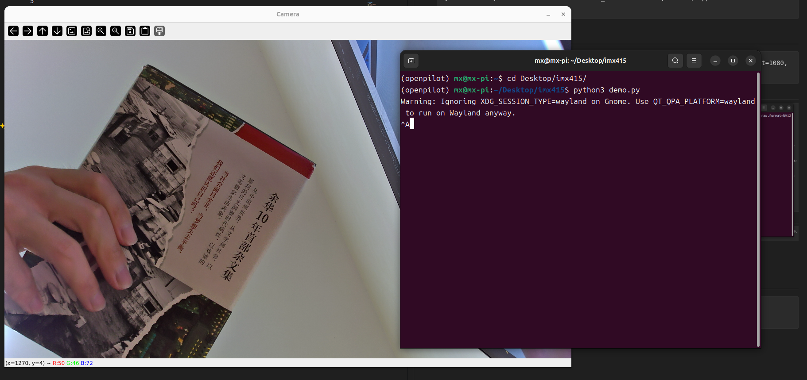

## Hardware Setup


## Download and Install Image (Ubuntu 24.04)
https://github.com/Joshua-Riek/ubuntu-rockchip

Click the link below to download the Orange Pi 5 image directly:
[https://github.com/Joshua-Riek/ubuntu-rockchip/releases/download/v2.4.0/ubuntu-24.04-preinstalled-desktop-arm64-orangepi-5.img.xz](https://github.com/Joshua-Riek/ubuntu-rockchip/releases/download/v2.4.0/ubuntu-24.04-preinstalled-desktop-arm64-orangepi-5.img.xz)

## The following steps are for Orange Pi 5 with Ubuntu 24.04

## First, extract the folder to the home directory
```bash
mv imx415.zip ~/
cd ~
unzip imx415.zip
cd ~/imx415/
```

## Back up dtb file
```bash
cd /usr/lib/firmware/6.1.0-1025-rockchip/device-tree/rockchip/
ls | grep rk3588s-orangepi-5
sudo cp rk3588s-orangepi-5.dtb rk3588s-orangepi-5.dtb.bak
```

## Replace dtb files
```bash
# dts directory
cd /usr/lib/firmware/6.1.0-1025-rockchip/device-tree/rockchip/
# Replace the main dtb that includes camera changes; currently overrides ov13855.
# If you need to use ov13855 later, simply restore this single file.
sudo cp ~/imx415/dts/rk3588s-orangepi-5.dtb ./
# imx415 dtbo overlays; copy over and do not modify
sudo cp ~/imx415/dts/orangepi-5-imx415-c* ./overlay/
```

## Configure u-boot
```bash
sudo vi /etc/default/u-boot

# Append the following two lines at the end; if already present, do not duplicate
U_BOOT_FDT="device-tree/rockchip/rk3588s-orangepi-5.dtb"
U_BOOT_FDT_OVERLAYS="device-tree/rockchip/overlay/orangepi-5-imx415-c1.dtbo"

# If you also have Wi‑Fi or other modules, separate by spaces in the same entry
U_BOOT_FDT_OVERLAYS="device-tree/rockchip/overlay/orangepi-5-ap6275p.dtbo device-tree/rockchip/overlay/orangepi-5-imx415-c1.dtbo"

```

## Update and reboot
```bash
sudo u-boot-update
sudo reboot
```

## Plug IMX415 into the CAM1 connector, then check debug logs after boot
```bash
sudo dmesg | grep imx415

# If you see output like below, it's successful
mx@mx-pi:~$ sudo dmesg | grep imx415
[   17.665535] imx415 7-001a: driver version: 00.01.08
[   17.665541] imx415 7-001a:  Get hdr mode failed! no hdr default
[   17.665548] imx415 7-001a: detect imx415 lane 4
[   17.665573] imx415 7-001a: could not get default pinstate
[   17.665575] imx415 7-001a: could not get sleep pinstate
[   17.665577] imx415 7-001a: Looking up dvdd-supply from device tree
[   17.665580] imx415 7-001a: Looking up dvdd-supply property in node /i2c@fec90000/imx415-1@1a failed
[   17.665598] imx415 7-001a: supply dvdd not found, using dummy regulator
[   17.665632] imx415 7-001a: Looking up dovdd-supply from device tree
[   17.665635] imx415 7-001a: Looking up dovdd-supply property in node /i2c@fec90000/imx415-1@1a failed
[   17.665642] imx415 7-001a: supply dovdd not found, using dummy regulator
[   17.665653] imx415 7-001a: Looking up avdd-supply from device tree
[   17.665655] imx415 7-001a: Looking up avdd-supply property in node /i2c@fec90000/imx415-1@1a failed
[   17.665661] imx415 7-001a: supply avdd not found, using dummy regulator
[   17.728448] imx415 7-001a: Detected imx415 id 0000e0
[   17.748219] imx415 7-001a: Consider updating driver imx415 to match on endpoints
[   17.748229] rockchip-csi2-dphy csi2-dphy0: dphy0 matches m00_b_imx415 7-001a:bus type 5
[   20.500537] imx415 7-001a: set hdr cfg, set mode to 0
[   20.500544] imx415 7-001a: set fmt: cur_mode: 3864x2192, hdr: 0, bpp: 10

```

## Preview video
```bash
gst-launch-1.0 v4l2src device=/dev/video11 ! video/x-raw,format=NV12,width=1920,height=1080, framerate=60/1 ! xvimagesink
```


## Run demo
```bash
pip install opencv-python
python3 demo.py
```


## Other RK3588 variants
Refer to the changes under the `dts-original` directory to modify and build the corresponding dtb files as needed.